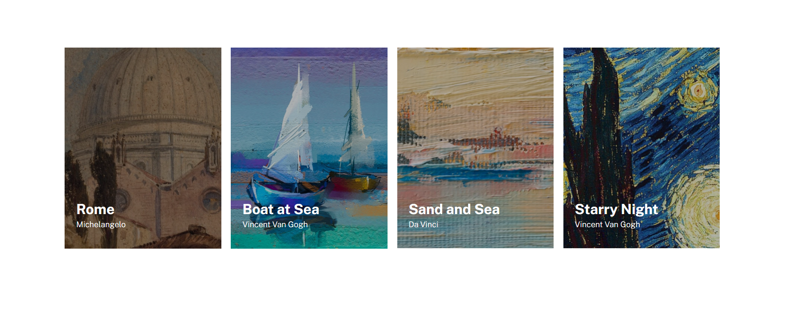

# Projeto HTML+CSS

## Um repositório com o intuito de praticar HTML e CSS.

[]

## Tecnologias utilizadas:
---
 

- HTML

- CSS

 

## Desafio realizado nesse projeto:
---

Página criada a partir de um exercício para praticar HTML e CSS.  
O projeto teria que ter um layout igual ao do figma que foi disponibilizado.  
O requisito é fazer uma página com quatro imagens centralizadas na página, posicionadas uma do lado da outra, com uma breve descrição de cada uma delas.  
Também deixando o projeto responsivo.