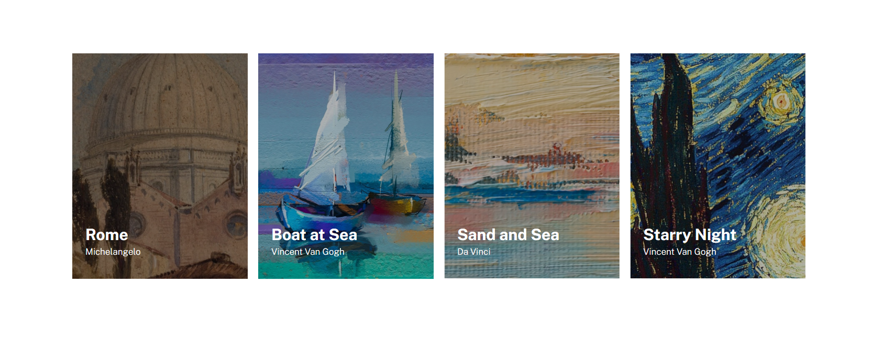

# Projeto Lista de imagens

Projeto com o objetivo de praticar HTML e CSS.

## Desafio realizado nesse projeto:

- Página criada a partir de um exercício para praticar HTML e CSS.
- O projeto tem que ter um layout igual ao do figma que foi disponibilizado.
- fazer uma página com quatro imagens centralizadas, posicionadas uma do lado da outra, com uma breve descrição de cada uma delas.
- deixar o projeto responsivo, posicionando as imagens em um coluna nas versões mobile.
## Screenshot

### Desktop

### Mobile

## Tecnologias utilizadas:
- HTML
- CSS

## Link
URL - [Lista de imagens](https://alexjr53.github.io/Lista-de-imagens/)

## Autor
GitHub - [Alexjr53](https://github.com/Alexjr53)
